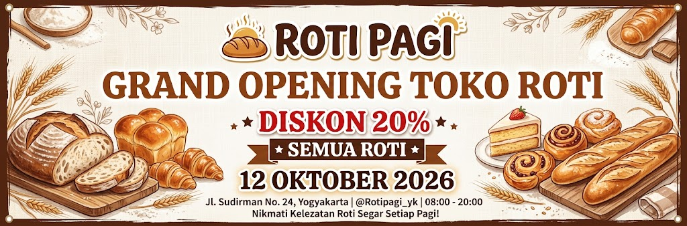
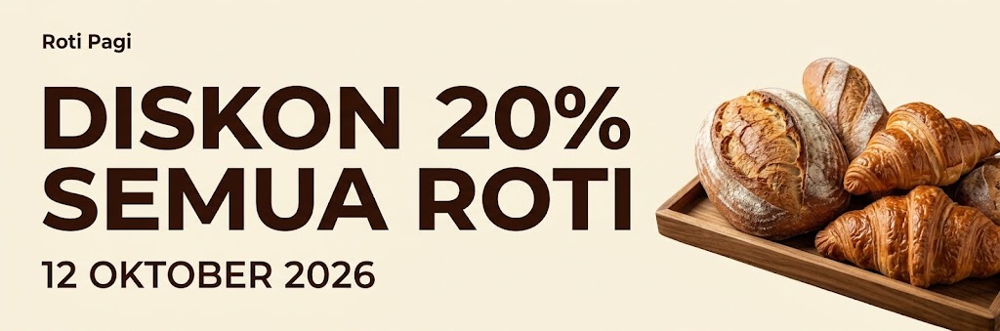

# anti-spanduk-ai

Instruksi siap pakai untuk membuat desain spanduk cetak dan banner media sosial tanpa estetika generik AI. Diunggah sebagai file instruksi ke ChatGPT atau Gemini, lalu langsung menghasilkan gambar dari brief singkat.

## Cara pakai

1. Unggah file `anti-spanduk-ai.md` ke ChatGPT atau Gemini.
2. Tulis brief singkat sambil menegaskan acuan pedoman. Contoh:

   > Buat sesuai pedoman anti-spanduk-ai.md: Banner cetak 3 × 1 meter untuk pembukaan toko roti. Nama: Roti Pagi. Tanggal: 12 Oktober 2026. Pesan: Diskon 20% semua roti. Warna merek: krem dan cokelat.

3. Model akan menanyakan detail yang kurang (jika ada), lalu langsung menghasilkan gambar lengkap dengan teks.
4. Periksa hasil dengan checklist yang disertakan model. Salah eja atau teks rusak? Minta perbaikan — instruksi sudah mengatur perbaikan bertahap.

> [!TIP]
> **Tips Sesi Chat:** Jika membuka percakapan baru atau membuat revisi lanjut, selalu tegaskan kembali kalimat: *"Buat/revisi sesuai pedoman anti-spanduk-ai.md"* agar AI tidak kembali ke gaya generik bawaan. Untuk ChatGPT Plus, Anda juga bisa memasukkan file ini ke dalam **Custom GPT** agar selalu aktif otomatis tanpa perlu diunggah ulang.

## Isi

- Prinsip pesan spesifik dan hierarki jarak baca
- 17 pola estetika AI generik yang dihindari, beserta penggantinya
- Aturan teks yang dirender image generator
- Perbedaan kebutuhan cetak dan media sosial
- Checklist verifikasi hasil otomatis

## Sebelum & Sesudah

### Sebelum (Prompt Biasa / Estetika AI Generik)



- Terlalu ramai dengan ornamen dekoratif dan bingkai klise
- Hierarki teks hilang dan bertumpuk
- Sulit dibaca dari kejauhan

### Sesudah (Dengan anti-spanduk-ai)



- Tipografi tebal, kontras kuat, dan langsung terbaca
- Hierarki jelas: penawaran utama dan tanggal langsung terlihat
- Visual produk nyata dengan ruang negatif yang lega

## Batasan

Image generator tidak menjamin teks benar atau file siap cetak. Hasil wajib diperiksa untuk ejaan, resolusi aktual, bleed, dan profil warna sebelum masuk percetakan.

## Struktur

```text
anti-spanduk-ai.md   <- unggah ini ke ChatGPT/Gemini
README.md
assets/
  before.png
  after.png
```
